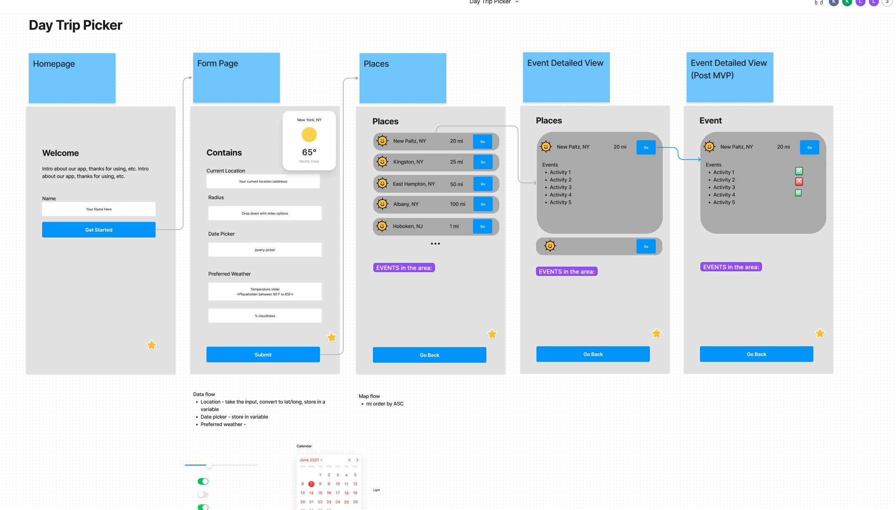

# team-awesome-working-repo

# Deployed 
```
        <Entert URL here >
```

# User Story
```
  A user is bored and wants to be spontaneous.\So the user wants to use an app where it shows them activities\near them or a certain radius and based on weather type


user = consumer who wants to find a location for a day trip, based on their preferences (current geo, weather, travel distance (miles or hours?), things to do / events)
```

# Acceptance Criteria
## MVP:
```
GIVEN I am on home page
WHEN I eneter my name
THEN app will personalize interaction with me
GIVEN I am on destination page
WHEN I eneter my location, select radius and date
THEN I will be asked to input my weather perference
WHEN I fill up destination and weather perference 
THEN System will find location I can visit and give me city name, mile, weather and activity.
WHEN I click on tap suggestion modules
THEN modules will expend

```
## Post MVP
```
WHEN I click on 'GO' in suggestion modules
THEN Display map, and activity list pin
AND Display Transportation and its ETA to the destinations

```
# team roles


# features
user completes a form:
- current location (input address in Google Maps lookup. Save in local storage for easy future search?)
- calendar (date picker?)
- preferred weather (select sun or rain, probability of rain below a certain amount, certain temperature, etc.)
- local events (dropdown?)
- categories of things to do (select all that apply or dropdown? or select 3-5?)

# designs
- https://www.figma.com/file/C9CDKe11cJE0gtFzcmvYMr/Day-Trip-Picker?node-id=0%3A1

# tech used
- HTML, CSS
- Bootstrap and one other framework
- jQuery for dropdowns
- Mapquest API
- TomTom Map API
# Infomation about API Keys
All api keys are stored in apiKeys.json document which is ignored in git that way the sensitive keys will not be upload to public. So for your to debug or run locally you will have to create apiKeys.json in environmentDoc folder. 
Look at the ReadMe.md file in environmentDoc folder to learn how to set-up.
### How would you use it in your script
1. You will have to import the document to your script by useing 
```
       1. import * as apiKeys from '../environmentDoc/apiKeys.json'; 
```
2. Pass in the keys
```
        var requestUrl = `http://www.mapquestapi.com/geocoding/v1/address?key=${apiKeys.mapQuestKey}&location=1600+Pennsylvania+Ave+NW,Washington,DC,20500`;

```

# timeline
